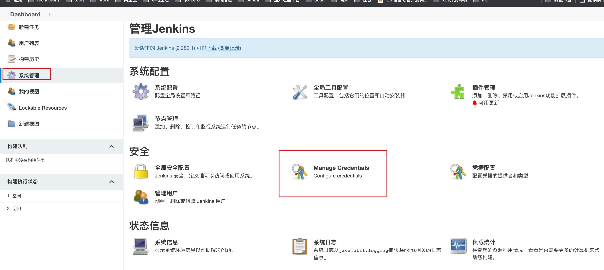
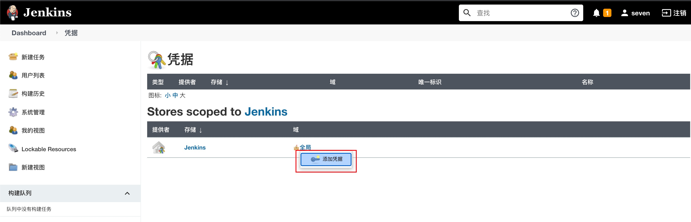
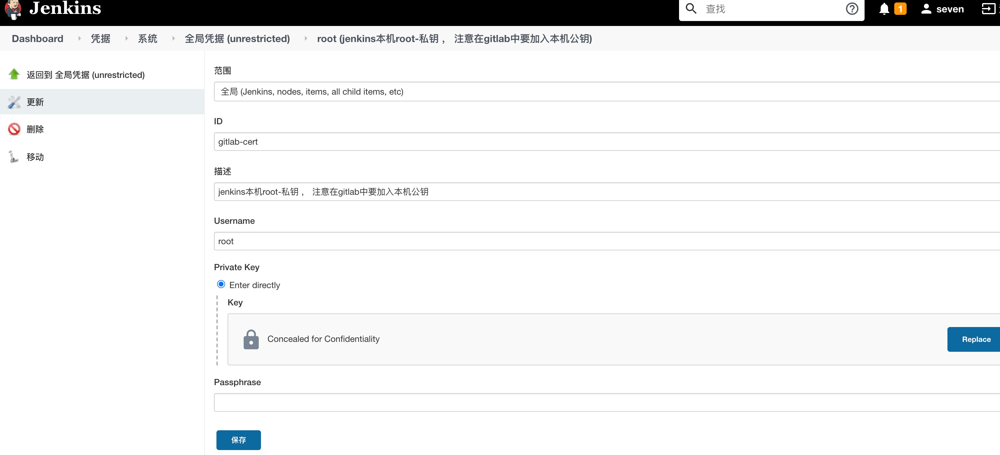
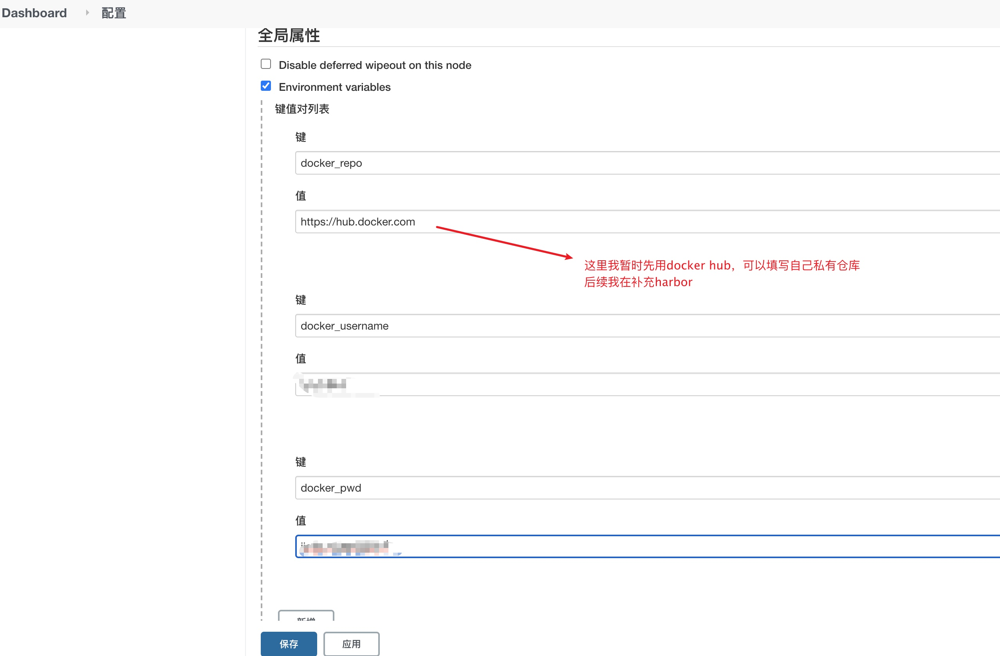
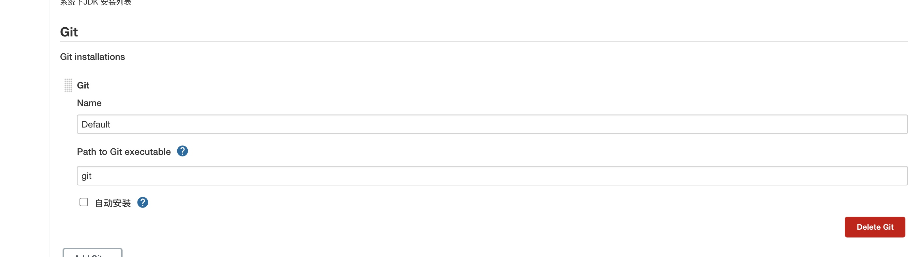
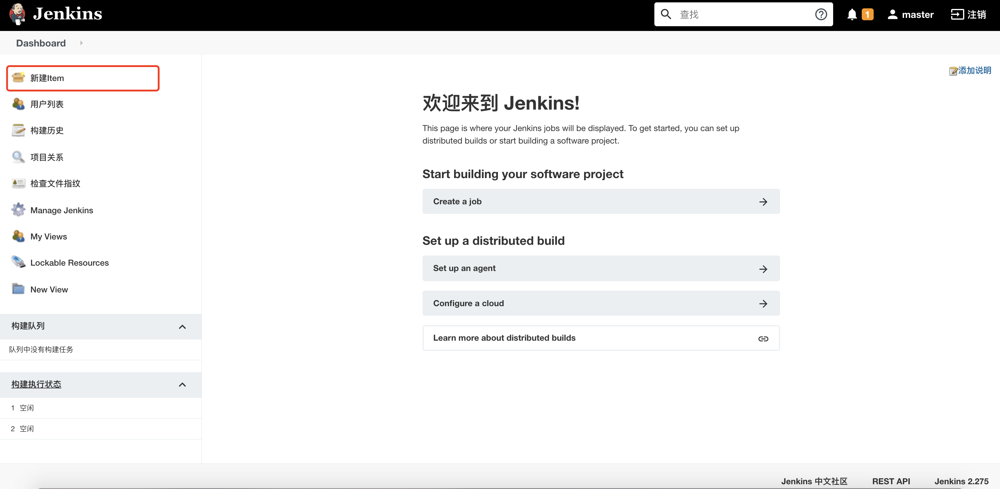
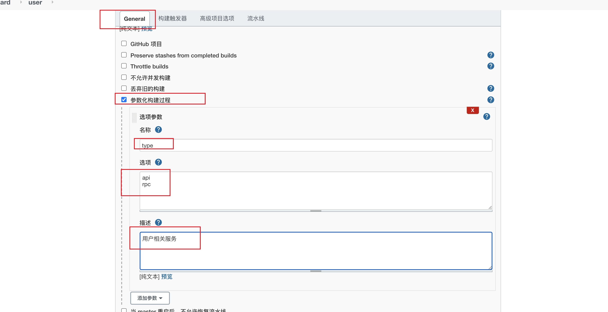
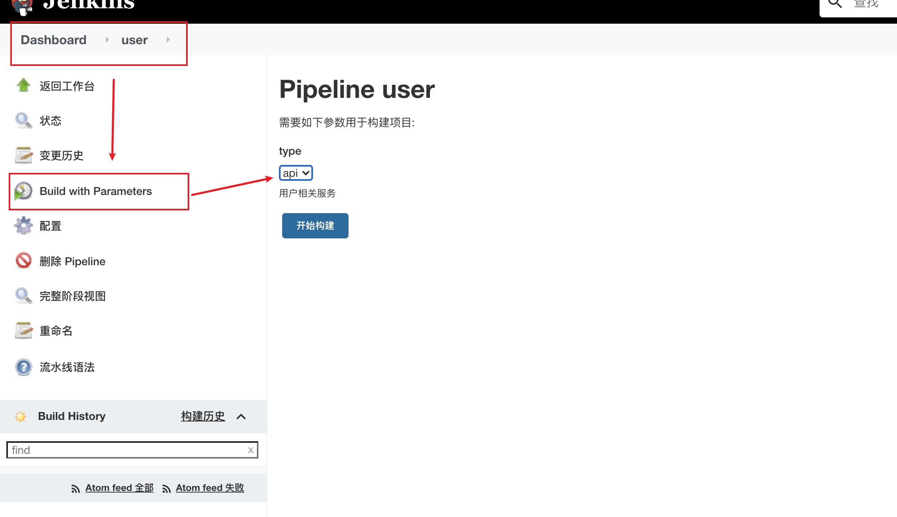

### 一、搭建gitlab仓库

#### 1、安装gitlab

```shell
  docker run --detach \
    --hostname 172.20.10.11 \
    --publish 443:443 --publish 80:80 --publish 222:22 \
    --name gitlab --restart always \
    --volume /srv/gitlab/config:/etc/gitlab \
  --volume /srv/gitlab/logs:/var/log/gitlab \
  --volume /srv/gitlab/data:/var/opt/gitlab \
    gitlab/gitlab-ce:latest
```

按上面的方式，gitlab容器运行没问题，但在gitlab上创建项目的时候，生成项目的URL访问地址是按容器的hostname来生成的，也就是容器的id。作为gitlab服务器，我们需要一个固定的URL访问地址，于是需要配置gitlab.rb（宿主机路径：/srv/gitlab/config/gitlab.rb）配置有三个参数如：

```config
external_url 'http://172.20.10.11'
gitlab_rails['gitlab_ssh_host'] = '172.20.10.11'
gitlab_rails['gitlab_shell_ssh_port'] = 222
```

然后让docker重新载入配置

```shell
$ docker exec -it gitlab /bin/bash  #进去gitlab容器的命令
$ gitlab-ctl reconfigure  #重置gitlab客户端的命令
```

退出容器重启一下

```shell
$ docker restart gitlab
```

默认账号：root

第一次登陆设置密码： abc123456

【备注连接】：https://www.jianshu.com/p/0bc9b4755082

#### 2、安装gitlab runner

```shell
docker run -d --name gitlab-runner --restart always \
  -v /srv/gitlab-runner/config:/etc/gitlab-runner \
  -v /var/run/docker.sock:/var/run/docker.sock \
  gitlab/gitlab-runner:latest
```

#### 3、注册runner到gitlab

1）root账号打开gitlab，点击dashboaed，runner，右侧以一个token复制

2）执行如下注册命令（注意域名、taglist）

```shell
docker run --rm -v /srv/gitlab-runner/config:/etc/gitlab-runner gitlab/gitlab-runner register \
  --non-interactive \
  --executor "docker" \
  --docker-image alpine:latest \
  --url "http://172.20.10.11/" \
  --registration-token "348XoYxhzrxU3zvqYx7S" \
  --description "first-register-runner" \
  --tag-list "test-cicd1,dockercicd1" \
  --run-untagged="true" \
  --locked="false" \
  --access-level="not_protected"
```

#### 4、runner配置文件中配置docker命令

```shell
"/usr/bin/docker:/usr/bin/docker", "/var/run/docker.sock:/var/run/docker.sock"
```


#### 5、在gitlab创建一个代码仓库，并在代码仓库中设置cicd启用上面的runner


#### 6、在代码根目录中添加“.gitlab-ci.yml”以及shell文件

.gitlab-ci.yml

```yml
image: golang:1.16

before_script:
  - chmod a+x $CI_PROJECT_DIR/build/script/ci/ci.sh

stages:
  - test
#  - build

unit_tests:
  stage: test
  script:
    - bash -c 'echo $CI_PROJECT_DIR && cd $CI_PROJECT_DIR && $CI_PROJECT_DIR/build/script/ci/ci.sh test'

race_detector:
  stage: test
  script:
    - bash -c 'echo $CI_PROJECT_DIR && cd $CI_PROJECT_DIR && $CI_PROJECT_DIR/build/script/ci/ci.sh race'

code_coverage:
  stage: test
  script:
    - bash -c 'echo $CI_PROJECT_DIR && cd $CI_PROJECT_DIR && .$CI_PROJECT_DIR/build/script/ci/ci.sh coverage'

lint_code:
  stage: test
  script:
    - bash -c 'echo $CI_PROJECT_DIR && cd $CI_PROJECT_DIR && $CI_PROJECT_DIR/build/script/ci/ci.sh lint'


#code_coverage_report:
#  stage: test
#  script:
#    - bash -c 'echo $CI_PROJECT_DIR && cd $CI_PROJECT_DIR && $CI_PROJECT_DIR/build/script/ci/ci.sh coverhtml'
#  only:
#    - master


#build:
#  stage: build
#  script:
#    - bash -c 'echo $CI_PROJECT_DIR && cd $CI_PROJECT_DIR && $CI_PROJECT_DIR/build/script/ci/ci.sh build'
```

ci.sh

```shell
#!/bin/bash

set -e

CUR_DIR=$PWD
SRC_DIR=$PWD
cmd=$1

export GOPATH=~/go
export GOBIN=~/go/bin
export GO111MODULE=on
export PATH=$PATH:/usr/local/go/bin
export GOPROXY=https://goproxy.io,direct

PKG_LIST=$(go list ./... | grep -v /vendor/)
LINT_VER=v0.0.0-20190409202823-959b441ac422

# Code coverage generation
function coverage_test(){
    COVERAGE_DIR="${COVERAGE_DIR:-coverage}"
    mkdir -p "$COVERAGE_DIR";
    for package in ${PKG_LIST}; do
        go test  -covermode=count -coverprofile "${COVERAGE_DIR}/${package##*/}.cov" "$package" ;
    done ;
    echo 'mode: count' > "${COVERAGE_DIR}"/coverage.cov ;
    tail -q -n +2 "${COVERAGE_DIR}"/*.cov >> "${COVERAGE_DIR}"/coverage.cov ;
    go tool cover -func="${COVERAGE_DIR}"/coverage.cov ;
    if [ "$1" == "html" ]; then
        go tool cover -html="${COVERAGE_DIR}"/coverage.cov -o coverage.html ;
    fi
    rm -rf "$COVERAGE_DIR";
}

case $cmd in
    lint) $0 dep && $GOBIN/golint -set_exit_status ${PKG_LIST} ;;
    test) go test  -short ${PKG_LIST} ;;
    race) go test  -race -short ${PKG_LIST} ;;
    coverage) coverage_test ;;
    coverhtml) coverage_test html ;;
    dep) go get -v golang.org/x/lint@$LINT_VER && cd $GOPATH/pkg/mod/golang.org/x/lint@$LINT_VER/ && go install ./... && cd $CUR_DIR ;;
    build) $0 dep && go build ./... ;;
    clean) rm -rf ${PKG_LIST} && git checkout . ;;
esac

cd $CUR_DIR
```


#### 7、分支管理

创建dev、release、hotfix分支，将dev、master、hotfix分支保护起来，只允许合并代码不能直接推送代码到仓库，这样通过合并代码的人在查看提交代码上一次的ci时候是否通过，不通过就不给合并


### 二、搭建harbor

#### 1、安装docker-compose，这个就不在描述了自行百度

```shell
yum install -y docker-compose
```


#### 2、下载并解压

　下载安装包：官网地址：https://github.com/vmware/harbor/releases/

```shell
$ wget https://github.com/vmware/harbor/releases/download/v2.0.0/harbor-offline-installer-v2.0.0.tgz
```


　*上传后解压：*

```shell
tar -xzvf harbor-offline-installer-v2.0.0.tgz
```

#### 3、使用OpenSSL配置harbor所需认证

  harbor推送拉去镜像默认是使用https。所以需要配置https认证。https认证一般有两种方式，一种是自签，另一种是向官方申请https证书。

  OpenSSL提供的CA（证书管理中心）可实现证书签发的整个流程。下面将记录设置https自签步骤。

（1）生成私钥

```shell
$ mkdir  /https/ca  -p
$ chmod  -R 777 /https/ca/
$ cd /https/ca/
$ openssl genrsa -des3 -out harbor.key 2048
```

⚠️  输入密码 “1234”

（2）生成CA证书

```shell
$ openssl req -sha512 -new \
-subj "/C=CN/ST=JS/L=WX/O=zwx/OU=jhmy/CN=10.0.0.28" \
-key harbor.key \
-out harbor.csr
```

⚠️  输入密码 “1234”

（3）备份证书

```shell
$ cp harbor.key  harbor.key.org
```

（4）退掉私钥密码，以便docker访问（也可以参考官方进行双向认证）

```shell
$ openssl rsa -in harbor.key.org -out harbor.key
```

⚠️  输入密码 “1234”

（5）使用证书进行签名

```shell
$ openssl x509 -req -days 100000  -in harbor.csr -signkey harbor.key -out harbor.crt
```

（6）设置harbor证书配置

```shell
$ cd /root/app/harbor/
$ cp harbor.yml.tmpl harbor.yml
$ vim harbor.yml
hostname: 10.0.0.28
http:
  port: 8082
https:
  # https port for harbor, default is 443
  port: 443
  # The path of cert and key files for nginx
  certificate: /https/ca/harbor.crt
  private_key: /https/ca/harbor.key
harbor_admin_password: Com.123
```

（7）安装harbor

```shell
./install.sh  --with-clair
```

⚠️  --with-clair启用漏洞扫描

（8）访问直接用https://10.0.0.28 ,但是自己制作的证书chrome 不让访问，用firefox打开，点击接受风险就好了

输入账号密码admin、Harbor12345


【注】：

​	如果是harbor-db这个容器启动失败，基本是因为挂在到主机目录中的data有数据了（之前安装的），清除就好了

​	如果修改了配置文件就docker-compose down 、./prepare 、docker-compose up -d


（9）创建用户

​	seven : Seven123456


   (10) 创建项目 looklook私有

  点击设置成员，把seven设置成“开发人员”，具有pull、push镜像权限


（11）拉取镜像nginx，并打标上传到我的私有仓库做一个测试

```shell
# 配置配置镜像仓库地址并重启docker和harbor服务
[root@harbor ~]# cat  /etc/docker/daemon.json 
{
   "registry-mirrors": ["https://7bc3o1s2.mirror.aliyuncs.com"],
   "insecure-registries": ["http://172.20.10.11:8082"]
}
[root@harbor ~]# systemctl restart docker

# 拉取Nginx镜像作为测试使用
[root@harbor ~]# docker  pull  nginx:1.16
# 给镜像打上标签
- 镜像仓库地址/项目名称/标签信息
[root@harbor ~]# docker image tag  nginx:1.16.0  172.20.10.11:8082/looklook/nginx:1.16.1
# 登录仓库
[root@harbor ~]# docker login http://172.20.10.11:8082
Username: seven
Password: 
WARNING! Your password will be stored unencrypted in /root/.docker/config.json.
Configure a credential helper to remove this warning. See
https://docs.docker.com/engine/reference/commandline/login/#credentials-store

Login Succeeded
[root@harbor ~]# docker push 172.20.10.11:8082/looklook/nginx:1.16.1
The push refers to repository [172.20.10.11:8082/looklook/nginx]
c23548ea0b99: Pushed
82068c842707: Pushed
c2adabaecedb: Pushed
1.16.1: digest: sha256:2963fc49cc50883ba9af25f977a9997ff9af06b45c12d968b7985dc1e9254e4b size: 948
```


（12）拉取harbor刚刚上传的镜像，本地运行测试

```shell
$ docker pull 172.20.10.11:8082/looklook/nginx:1.16.1
$ docker run -d 172.20.10.11:8082/looklook/nginx:1.16.1
```


(13) 将nginx镜像换成我们项目中镜像即可使用harbor作为我们私有仓库


### 三、搭建jenkins并编写jekinsfile

#### 1、docker-compose

```yml
version: '3'
services:
  jenkins:
    restart: always
    image: jenkins/jenkins:lts
    container_name: jenkins
    privileged: true  #允许特权
    ports:
      - 9090:8080
      - 50000:50000
    volumes:
      - ./data/:/var/jenkins_home
      - ./maven/settings.xml:/var/jenkins_home/tools/hudson.tasks.Maven_MavenInstallation/maven/conf/settings.xml
      - /var/run/docker.sock:/var/run/docker.sock
      - /usr/bin/docker:/usr/bin/docker
      - /usr/local/bin/docker-compose:/usr/local/bin/docker-compose
      - /usr/lib/x86_64-linux-gnu/libltdl.so.7:/usr/lib/x86_64-linux-gnu/libltdl.so.
```

【注】：注意data目录权限

#### 2、登陆

查看/var/jenkins_home/secrets/initialAdminPassword下密码也就是本机的 ./data/secrets/initialAdminPassword，登陆并选择“安装推荐插件“

#### 3、创建管理员

root : seven

#### 4、添加凭据

查看jenkins所在机器的私钥，与前面gitlab公钥对应

进入jenkins，依次点击`Manage Jenkins`-> `Manage Credentials`





进入`全局凭据`页面，添加凭据，`Username`是一个标识，后面添加pipeline你知道这个标识是代表gitlab的凭据就行，Private Key`即上面获取的私钥




#### 5、 添加全局变量

进入`Manage Jenkins`->`Configure System`，滑动到`全局属性`条目，添加docker私有仓库相关信息，如图为`docker用户名`、`docker用户密码`、`docker私有仓库地址` （这里图中用的dockerhub，替换成上面我们搭建的harbor地址跟用户名、密码即可）




#### 6、配置git

进入`Manage Jenkins`->`Global Tool Configureation`，找到Git条目，填写jenkins所在机器git可执行文件所在path，如果没有的话，需要在jenkins插件管理中下载Git插件。




#### 7、添加一个Pipeline

进入jenkins首页，点击`新建Item`，名称为`user`




添加pipline所需要的选项参数




配置`user`服务，在`user`配置页面，向下滑动找到`Pipeline script`,填写脚本内容

```pipline
pipeline {
  agent any
  parameters {
      gitParameter name: 'branch', 
      type: 'PT_BRANCH',
      branchFilter: 'origin/(.*)',
      defaultValue: 'master',
      selectedValue: 'DEFAULT',
      sortMode: 'ASCENDING_SMART',
      description: '选择需要构建的分支'
  }

  stages {
      stage('服务信息')    {
          steps {
              sh 'echo 分支：$branch'
              sh 'echo 构建服务类型：${JOB_NAME}-$type'
          }
      }


      stage('check out') {
          steps {
              checkout([$class: 'GitSCM', 
              branches: [[name: '$branch']],
              doGenerateSubmoduleConfigurations: false, 
              extensions: [], 
              submoduleCfg: [],
              userRemoteConfigs: [[credentialsId: 'gitlab-cert', url: 'ssh://git@172.20.10.11:222/root/looklook.git']]])
          }   
      }

      stage('获取commit_id') {
          steps {
              echo '获取commit_id'
              git credentialsId: 'gitlab-cert', url: 'ssh://git@172.20.10.11:222/root/looklook.git'
              script {
                  env.commit_id = sh(returnStdout: true, script: 'git rev-parse --short HEAD').trim()
              }
          }
      }

      stage('Dockerfile Build') {
          steps{
                 sh 'cp  app/${JOB_NAME}/cmd/${type}/Dockerfile ./Dockerfile'
                 script{
                     env.image = sh(returnStdout: true, script: 'echo ${JOB_NAME}-${type}:${commit_id}').trim()
                 }
                 sh 'echo 镜像名称：${image}'
                 sh 'docker build -t ${image} .'
          }
      }

      stage('上传到镜像仓库') {
          steps{
              sh '/root/dockerlogin.sh'
              sh 'docker tag  ${image} ${dockerServer}/${image}'
              sh 'docker push ${dockerServer}/${image}'
          }
      }

      stage('部署到k8s') {
          steps{
              script{
                  env.deployYaml = sh(returnStdout: true, script: 'echo ${JOB_NAME}-${type}-deploy.yaml').trim()
                  env.port=sh(returnStdout: true, script: '/root/port.sh ${JOB_NAME}-${type}').trim()
              }

              sh 'echo ${port}'

              sh 'rm -f ${deployYaml}'
              sh '/usr/local/bin/goctl kube deploy -secret dockersecret -replicas 2 -nodePort 3${port} -requestCpu 200 -requestMem 50 -limitCpu 300 -limitMem 100 -name ${JOB_NAME}-${type} -namespace hey-go-zero -image ${dockerServer}/${image} -o ${deployYaml} -port ${port}'
              sh '/usr/bin/kubectl apply -f ${deployYaml}'
          }
      }

      stage('Clean') {
          steps{
              sh 'docker rmi -f ${image}'
              sh 'docker rmi -f ${dockerServer}/${image}'
              cleanWs notFailBuild: true
          }
      }
  }
}
```

【注】：

 1) ${credentialsId}要替换为你的具体凭据值，即【添加凭据】模块中的一串字符串，${gitUrl}需要替换为你代码的git仓库地址，其他的${xxx}形式的变量无需修改，保持原样即可。

2) 这里跟官方文档有一点点不一样，由于我项目文件夹目录不同，goctl生成的dockerfile文件我手动做了点调整，在一个我不是在构建时候生成的dockerfile，是在创建项目时候就把dockerfile一起放在目录下，这样构建镜像时候不需要goctl了


#### 8、安装Pipline中需要的插件

点击 “系统配置” -> “插件管理”，然后点击“可选插件”

- Git Parameter


#### 9、构建




### 四、配置k8s集群拉取harbor镜像


k8s在默认情况下，只能拉取harbor镜像仓库的公有镜像，如果拉取私有仓库镜像，则是会报 `ErrImagePull` 和 `ImagePullBackOff` 的错误


1、先在jenkins发布机器登陆harbor

```shell
$ docker login -u seven -p Seven123456 http://172.20.10.11:8082
Login Succeeded
```

2、在k8s中生成登陆harbor配置文件

```shell
#查看上一步登陆harbor生成的凭证
$ cat /root/.docker/config.json  
{
	"auths": {
		"172.20.10.11:8082": {
			"auth": "c2V2ZW46U2V2ZW4xMjM0NTY="
		}
	},
	"HttpHeaders": {
		"User-Agent": "Docker-Client/18.03.0-ce (linux)"
	}
}
```

3、对秘钥文件进行base64加密

```shell
$ cat /root/.docker/config.json  | base64 -w 0

ewoJImF1dGhzIjogewoJCSIxNzIuMjAuMTAuMTE6ODA4MiI6IHsKCQkJImF1dGgiOiAiYzJWMlpXNDZVMlYyWlc0eE1qTTBOVFk9IgoJCX0KCX0sCgkiSHR0cEhlYWRlcnMiOiB7CgkJIlVzZXItQWdlbnQiOiAiRG9ja2VyLUNsaWVudC8xOC4wMy4wLWNlIChsaW51eCkiCgl9Cn0=
```

4、创建docker-secret.yaml

```yml
apiVersion: v1
kind: Secret
metadata:
  name: docker-login
type: kubernetes.io/dockerconfigjson
data:
  .dockerconfigjson: ewoJImF1dGhzIjogewoJCSIxNzIuMjAuMTAuMTE6ODA4MiI6IHsKCQkJImF1dGgiOiAiYzJWMlpXNDZVMlYyWlc0eE1qTTBOVFk9IgoJCX0KCX0sCgkiSHR0cEhlYWRlcnMiOiB7CgkJIlVzZXItQWdlbnQiOiAiRG9ja2VyLUNsaWVudC8xOC4wMy4wLWNlIChsaW51eCkiCgl9Cn0=
```

```shell
$ kubectl create -f docker-secret.yaml

secret "docker-login" created
```

 5、然后在k8s的yml文件中添加即可

```yml
`
....
 imagePullSecrets:
    - name: docker-login
```


