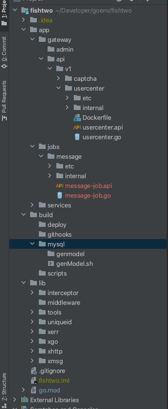

go的项目比较灵活不像java已经形成统一标准化了，所以对于不同项目的结构都不一样，我的做法是如下：

整个项目使用的一个大仓，项目fishtwo根目录下：

app : 应用内部程序

build：构建、以及脚本等

lib：应用程序用到的内部库

app下分为3个模块：

gateway：api服务

services： rpc服务

jobs：日常要处理的任务（这个可以使用go-zero作者的go-queue，测试了下很好用，哈哈，后面搞好也会写进来）

