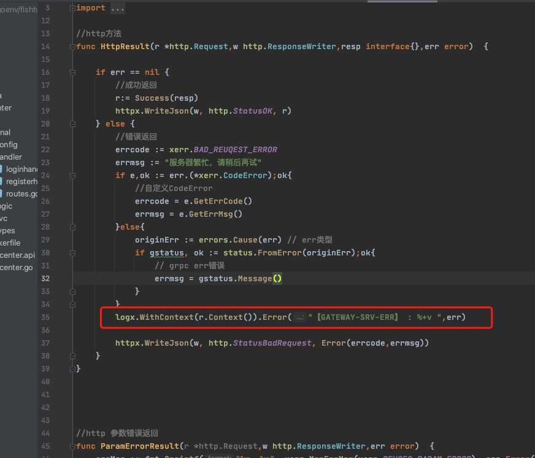
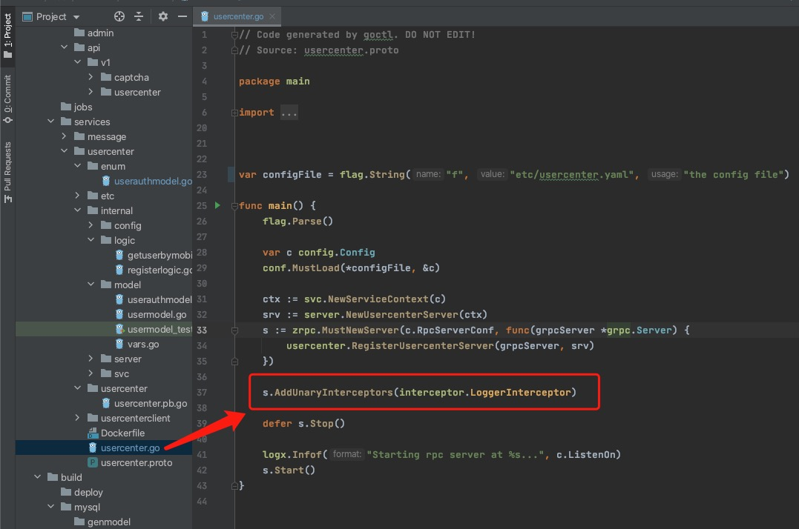
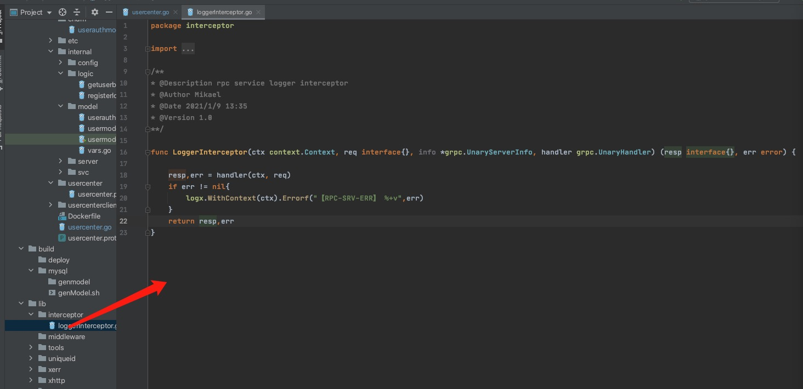
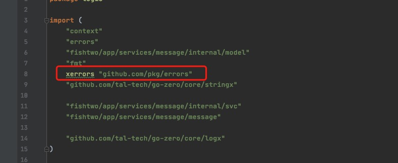
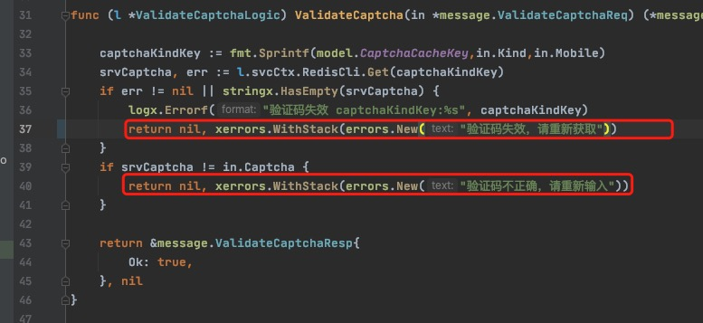

在前面说到gateway改造时候，如果眼神好的童鞋，在上面的httpresult.go中已经看到了log的身影：

我们在来看下rpc中怎么处理的

是的，我在每个rpc启动的main中加入了grpc拦截器 https://www.yuque.com/tal-tech/go-zero/ttzlo1，那让我们看看grpc拦截器里面做了什么

然后我代码里面使用github/pkg/errors这个包去处理错误的,这个包还是很好用的

所以呢，

我们在grpc中打印日志 logx.WithContext(ctx).Errorf("【RPC-SRV-ERR】 %+v",err)，

在api中打印日志logx.WithContext(r.Context()).Error("【GATEWAY-SRV-ERR】 : %+v ",err)

go-zero中打印日志，使用logx.WithContext 会把trace-id带入，这样一个请求下来，比如，user-api  --> user-srv  --> message-srv

那如果messsage-srv出错，他们三个是同一个trace-id，是不是就可以在elk通过输入这个trace-id一次性搜索出来这条请求报错堆栈信息呢？当然你也可以接入jager、zipkin、skywalking等等，这个我暂时还没接入

