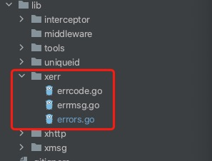
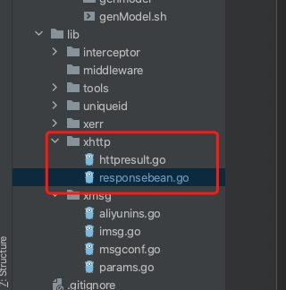
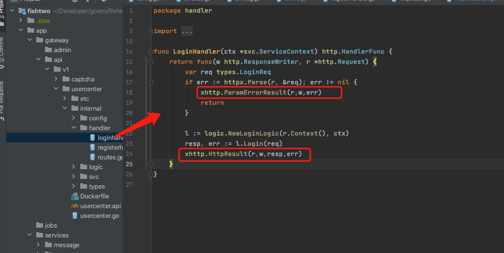

gateway中我做了一些自定义，在端请求我们后台接口情况下，虽然多数情况是不需要关心错误码的，但是避免不了要某些场景还是需要根据固定错误码去做特殊处理，我自己定义了一个错误类，这个错误类只在gateway中使用：

err.go:

```
package xerr

import "fmt"

type CodeError struct {
   errCode int
   errMsg  string
}

//属性
func (e *CodeError) GetErrCode() int {
   return e.errCode
}

func (e *CodeError) GetErrMsg() string {
   return e.errMsg
}

func (e *CodeError) Error() string {
   return fmt.Sprintf("ErrCode:%d，ErrMsg:%s", e.errCode, e.errMsg)
}

func New(errCode int, errMsg string) *CodeError {
   return &CodeError{errCode: errCode, errMsg: errMsg}
}

func NewErrCode(errCode int) *CodeError {
   return &CodeError{errCode: errCode, errMsg: MapErrMsg(errCode)}
}

func NewErrMsg(errMsg string) *CodeError {
   return &CodeError{errCode: BAD_REUQEST_ERROR, errMsg: errMsg}
}
```

errmsg.go

```
package xerr

var message map[int]string
func init()  {
   message = make(map[int]string)
   message[OK] = "SUCCESS"
   message[BAD_REUQEST_ERROR] = "服务器繁忙,请稍后再试"
   message[REUQES_PARAM_ERROR] = "参数错误"
   message[USER_NOT_FOUND] = "用户不存在"
}

func MapErrMsg(errcode int) string {
   if msg, ok := message[errcode]; ok {
      return msg
   }else{
      return "服务器繁忙,请稍后再试"
   }
}
```

errcode.go

```
package xerr

//成功返回
const OK = 200

/**(前3位代表业务,后三位代表具体功能)**/

//全局错误码
const BAD_REUQEST_ERROR = 100001
const REUQES_PARAM_ERROR = 100002

//用户模块
const USER_NOT_FOUND = 200001
```


我将三个文件统一放在lib/xerr目录



有了错误码还不行，还要定义统一返回http的结果，goctl生成的默认的是挺好的，但是没法符合我这种返回自定义错误码需求，于是我自己有写了一个统一返回结果的文件：

httpresult:

```
package xhttp

import (
   "fishtwo/lib/xerr"
   "fmt"
   "github.com/tal-tech/go-zero/core/logx"
   "github.com/tal-tech/go-zero/rest/httpx"
   "google.golang.org/grpc/status"
   "net/http"
   "github.com/pkg/errors"
)

//http方法
func HttpResult(r *http.Request,w http.ResponseWriter,resp interface{},err error)  {

   if err == nil {
      //成功返回
      r:= Success(resp)
      httpx.WriteJson(w, http.StatusOK, r)
   } else {
      //错误返回
      errcode := xerr.BAD_REUQEST_ERROR
      errmsg := "服务器繁忙，请稍后再试"
      if e,ok := err.(*xerr.CodeError);ok{
         //自定义CodeError
         errcode = e.GetErrCode()
         errmsg = e.GetErrMsg()
      }else{
         originErr := errors.Cause(err) // err类型
         if gstatus, ok := status.FromError(originErr);ok{
            // grpc err错误
            errmsg = gstatus.Message()
         }
      }
      logx.WithContext(r.Context()).Error("【GATEWAY-SRV-ERR】 : %+v ",err)

      httpx.WriteJson(w, http.StatusBadRequest, Error(errcode,errmsg))
   }
}


//http 参数错误返回
func ParamErrorResult(r *http.Request,w http.ResponseWriter,err error)  {
   errMsg := fmt.Sprintf("%s ,%s", xerr.MapErrMsg(xerr.REUQES_PARAM_ERROR), err.Error())
   httpx.WriteJson(w, http.StatusBadRequest, Error(xerr.REUQES_PARAM_ERROR,errMsg))
}
```

responsebean

```
package xhttp

type ResponseSuccessBean struct {
   Code int         `json:"code"`
   Msg  string      `json:"msg"`
   Data interface{} `json:"data"`
}
type NullJson struct {}

func Success(data interface{}) *ResponseSuccessBean {
   return &ResponseSuccessBean{200, "OK", data}
}


type ResponseErrorBean struct {
   Code int         `json:"code"`
   Msg  string      `json:"msg"`
}

func Error(errCode int,errMsg string) *ResponseErrorBean {
   return &ResponseErrorBean{errCode, errMsg}
}
```

放在 lib/xhttp下



然后改造了internal/handler/下通过goctl生成的代码：



当然你会说，每次生成完都要手动去改，好麻烦！ 

当当当当～～～ goctl的template来咯 https://www.yuque.com/tal-tech/go-zero/mkpuit

然后修改~/.goctl/api/handler.tpl:

```go
package handler

import (
	"net/http"

	{{.ImportPackages}}
)

func {{.HandlerName}}(ctx *svc.ServiceContext) http.HandlerFunc {
	return func(w http.ResponseWriter, r *http.Request) {
		{{if .HasRequest}}var req types.{{.RequestType}}
		if err := httpx.Parse(r, &req); err != nil {
			xhttp.ParamErrorResult(r,w,err)
			return
		}{{end}}

		l := logic.New{{.LogicType}}(r.Context(), ctx)
		resp, err := l.Login(req)
		xhttp.HttpResult(r,w,resp,err)
	}
}
```

在重新生成看看，是不是就 beautiful了，哈哈


然后在说我们的gateway log，如果眼神好的用户，在上面的httpresult.go中已经看到了log的身影：


是的是的，这样处理就可以啦，这样只要有错误呢就会打印日志呢，go-zero已经吧trace-id带进去了，啥？trace-id不知道是啥？嗯，其实就是把一次请求通过此id串联起来，比如你user-api调用user->srv 或者其他srv，那要把他们这一次请求都串联起来，需要一个唯一标识别，这个id就是做这个，做链路追踪有很多 比如jager、zinpink


